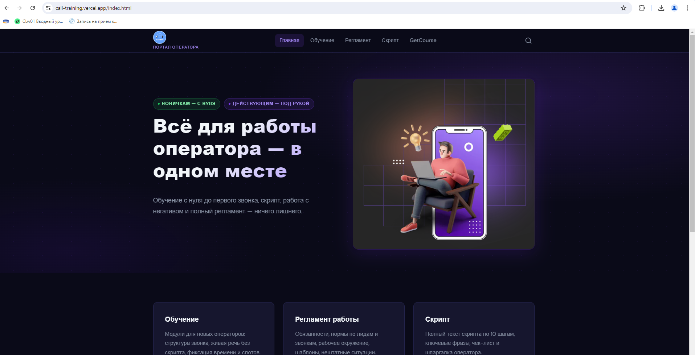
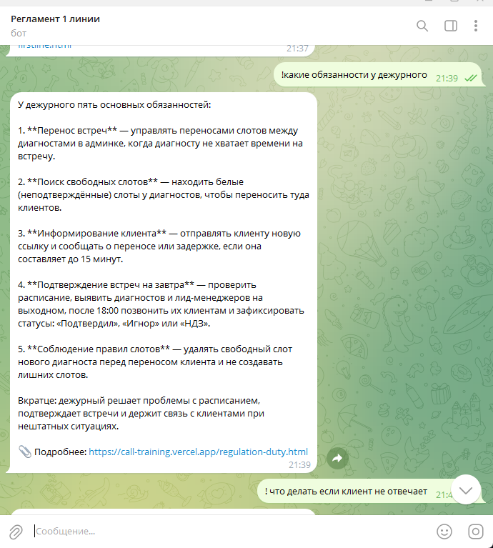
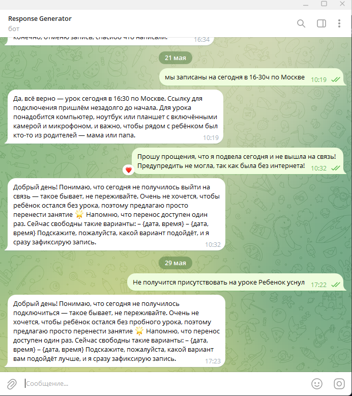

# Система адаптации и поддержки операторов — Матриус

Комплекс инструментов для обучения новых сотрудников, оперативного доступа к регламентам и генерации качественных ответов клиентам.

## Компоненты

| Компонент | Назначение | Ссылка |
|---|---|---|
| 🌐 Обучающий сайт | Онбординг новых операторов, регламент работы | [call-training.vercel.app](https://call-training.vercel.app/index.html) |
| 🤖 Бот регламента | Ответы на рабочие вопросы по базе знаний | [@Reglament547Bot](https://t.me/Reglament547Bot) |
| 💬 Бот ответов клиентам | Генерация готовых ответов для операторов | [@ResponseGeneratorBot](https://t.me/ResponseGeneratorBot) |

## Скриншоты

**Обучающий сайт**


**Бот регламента — @Reglament547Bot**


**Бот ответов клиентам — @ResponseGeneratorBot**


---

## Как пользоваться ботами

### @Reglament547Bot — регламент
Отвечает на вопросы по рабочим процессам. Работает только с сообщениями, начинающимися с `!`.

```
! что делать если клиент не отвечает
```

### @ResponseGeneratorBot — ответы клиентам
Генерирует готовый текст ответа клиенту по регламенту и шаблонам. Оператор вставляет сообщение клиента — бот возвращает готовую формулировку. Работает только с сообщениями, начинающимися с `!`.

```
! Дорого, у других дешевле
```

---

## Структура проекта

```
├── bot_claude.py       ← бот ответов клиентам (@ResponseGeneratorBot)
├── card/site/          ← обучающий сайт (HTML)
├── scripts/
│   └── regulation_bot/ ← бот регламента (@Reglament547Bot)
├── tmp/                ← снапшот базы знаний (operator-kb.md)
├── reports/            ← логи запросов и отчёты
├── .claude/            ← скиллы и агенты Claude Code
└── .env                ← токены и ключи (не коммитить)
```

---

## Установка и запуск

### Требования

- Python 3.11+
- Claude Code CLI (`claude`)
- Аккаунт Telegram-бота (токены в `.env`)

### 1. Клонировать репозиторий

```bash
git clone <repo-url>
cd project_knowledge_base
```

### 2. Создать `.env`

Скопировать `.env.example` и заполнить:

```env
REGULATION_BOT_TOKEN=   # токен @Reglament547Bot
TELEGRAM_TOKEN=         # токен @ResponseGeneratorBot
NOTION_TOKEN=           # Notion Integration Token
```

### 3. Установить зависимости

**Бот ответов клиентам** (из корня проекта):
```bash
pip install -r requirements.txt
```

**Бот регламента:**
```bash
pip install -r scripts/regulation_bot/requirements.txt
```

### 4. Авторизовать Claude Code

Бот ответов клиентам вызывает `claude` как subprocess — без авторизации не работает:
```bash
claude login
```

### 5. Запустить боты

Каждый бот — отдельный процесс в отдельном терминале.

**Терминал 1 — бот ответов клиентам** (из корня проекта):
```bash
python bot_claude.py
```

**Терминал 2 — бот регламента** (из корня проекта):
```bash
python scripts/regulation_bot/bot.py
```

---

## Обновление базы знаний

База знаний хранится в Notion и синхронизируется с сайтом и ботами через Claude Code.

Если изменилось содержимое в Notion — запустить в Claude Code:
```
/kb-sync
```

Пайплайн: Notion → `tmp/notion-snapshot.md` → сайт + `tmp/operator-kb.md`

---

## Технологии

| Слой | Технология |
|---|---|
| Язык | Python 3 |
| LLM | Claude API (Anthropic) — `claude-haiku-4-5` / `claude-sonnet-4-6` |
| База знаний | Notion + локальный HTML-индекс сайта |
| Канал | Telegram Bot API |
| Сайт | HTML / CSS, деплой на Vercel |
| Управление KB | Claude Code CLI + MCP Notion |
